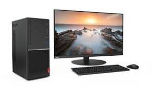
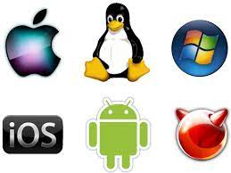
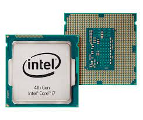
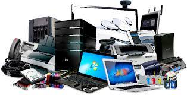
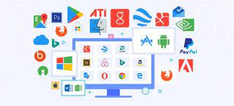
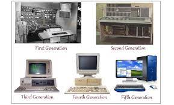

#  A. PC (Perangkat Komputer)

 

Komputer adalah alat yang dipakai untuk mengolah data menurut perintah yang telah diprogram. Kata komputer semula dipergunakan untuk menggambarkan orang yang perkerjaannya melakukan perhitungan aritmetika, dengan atau tanpa alat bantu, tetapi arti kata ini kemudian dipindahkan kepada mesin itu sendiri. Pada awalnya, pengolahan informasi hampir eksklusif berhubungan dengan masalah aritmatika, tetapi komputer modern dipakai untuk banyak tugas yang tidak berhubungan dengan matematika.

Secara luas, Komputer dapat didefinisikan sebagai suatu peralatan elektronik yang terdiri dari beberapa komponen, yang dapat bekerja sama antara komponen satu dengan yang lain untuk menghasilkan suatu informasi berdasarkan program dan data yang ada. Konsep komponen-komponen komputer ini berasal dari arsitektur von Neumann, ketika John von Neumann memaparkan arsitekturnya pada tahun 1945.

# B. Laptop

Laptop pertama kali dirancang oleh seseorang yang bernama Adam Osbornen yang gemar terhadap teknologi. Ia seseorang berkebangsaan United Kingdom, dan lahir di Inggris pada tanggal 6 Maret 1939. nah, ide Osborne untuk membuat laptop ini muncul dari seseorang yang bernama Alan Kay. Kay mempunyai konsep tentang sebuah komputer jinjing, yang nantinya menjadi cikal bakal dari laptop yang sekarang kita pakai. Dari ide Kay, Osborne kemudian membuat sebuah portable computer pertama yang diberi nama Osborne 1. Osborne bekerjasama dengan perusahaan perangkat keras yang juga ahli dalam mendesain papan sirkuit prosesor. Pada saat itu, tentunya Osborne 1 ini sangat berbeda jauh dengan komputer jinjing yang banyak kita kenal saat ini. Osborne 1 ini memiliki berat lebih dari 10 kilogram, dan dengan ukuran layar hanya 5 inci. Laptop ini juga sudah dilengkapi dengan baterai kecil, floppy disk, memori, dan keyboard.

Sekarang Laptop, komputer jinjing, atau komputer pangku adalah komputer pribadi yang berukuran relatif kecil dan ringan. Beratnya berkisar dari 1–6 kg, tergantung pada ukuran, bahan, dan spesifikasi laptop tersebut. Sumber daya laptop berasal dari baterai atau adaptor A/C yang dapat digunakan untuk mengisi ulang baterai dan menyalakan laptop itu sendiri. Baterai laptop pada umumnya dapat bertahan kurang lebih 2 hingga 6 jam sebelum akhirnya habis. Habisnya baterai bergantung dari cara pemakaian, spesifikasi, dan ukuran baterai. Laptop terkadang disebut juga dengan komputer notebook atau notebook saja.

Sebagai komputer pribadi, laptop memiliki fungsi yang sama dengan komputer desktop (desktop computers) pada umumnya. Komponen yang terdapat di dalamnya sama persis dengan komponen pada desktop, hanya saja ukurannya diperkecil, dijadikan lebih ringan, lebih tidak panas, dan lebih hemat daya.

# C. Sistem Operasi

Secara umum, sistem operasi adalah perangkat lunak pada lapisan pertama yang ditempatkan pada memori komputer pada saat komputer dinyalakan booting. Sedangkan software-software lainnya dijalankan setelah sistem operasi berjalan, dan sistem operasi akan melakukan layanan inti untuk software-software itu.

Sebelum ada sistem operasi, komputer hanya menggunakan sistem sinyal analog dan sinyal digital. Seiring dengan berkembangnya pengetahuan dan teknologi, pada saat ini terdapat berbagai sistem operasi dengan keunggulannya masing-masing.

Sistem operasi mempunyai penjadwalan yang sistematis mencakup perhitungan penggunaan memori, pemrosesan data, penyimpanan data, dan sumber daya lainnya. Contoh sistem operasi modern adalah Linux, Android, iOS, Mac OS X, dan Microsoft Windows.

Fungsi Sistem Operasi:
1. Manajemen Sumber Daya Komputer
2. Berperan Sebagai Aplikasi Dasar Perangkat
3. Menghubungkan Hardware
4. Mengatur Sistem Kerja Perangkat

# D. Prosesor

Prosesor adalah komponen utama atau otak dari laptop / komputer Anda. Prosesor terletak tepat di tengah motherboard. Prosesor memiliki fungsi yang penting bagi seluruh operasi perangkat komputer karena semua perintah dimulai dari processor. Maka dari itu, memilih prosesor terbaik untuk mendukung pekerjaan menggunakan komputer atau laptop sangat penting bagi pengguna. Mulai dari pekerjaan sederhana seperti menulis, membalas e-mail, berselancar di internet, main game, dan mengolah grafis semua dilakukan dengan komputer atau laptop.

Fungsi Prosesor
Fungsi processor secara umum adalah mengolah perintah yang masuk kemudian dikeluarkan berupa output yaitu pemberi perintah. Fungsi prosesor adalah:

1. Memastikan komputer bekerja dengan baik

2. Menjalankan proses informasi pada komputer

3. Memberikan perintah kepada tiap komponen komputer

Komponen Prosesor
1. Control Unit (CU)

Pengatur lalu lintas dan kegiatan data yang ada di dalam komputer seperti input dan output. Aktivitas bisa dieksekusi tanpa ada tumpang tindih dan dilakukan secara teratur.

2. Artimatics Logical Unit (ALU)

Komponen yang melakukan perhitungan aritmatika sesuai perintah yang diperoleh. Perhitungan digunakan supaya komputer dalam membaca instruksi dengan benar. Di dalam komponen ini, prosesor benar-benar melakukan pekerjaan yang penting pada sebuah sistem.

3. Register Unit (RU)

Komponen ini adalah alat penyimpanan yang lebih kecil daripada memory utama dan memiliki kecepatan akses cukup tinggi. Data yang telah diolah CU dan ALU akan disimpan di komponen ini untuk nantinya diolah kembali.

Merek Prosesor
Berikut adalah beberapa jenis dan merek prosesor yang beredar di pasaran:

1. Intel

Processor Intel adalah prosesor paling populer dan banyak digunakan pada laptop atau komputer. Kelebihan prosesor ini di antaranya adalah lebih tahan panas, ada turbo boost yang dapat mempercepat proses kerja pada komputer.

2.  AMD (Advanced Micro Devices)

Processor AMD adalah saingan terbesar prosesor Intel, tapi lebih disukai oleh gamers karena AMD dilengkapi denga VGA ATi Radeon.

3. IBM (International Bussiness Machines Corporation)

IBM memproduksi perangkat keras dan perangkat lunak. Prosesor yang pernah diproduksi oleh IBM di antaranya adalah Pentium II Xeon dan IBM POWER.

4.  Apple

Apple memproduksi beragam prosesor dan penjualan software komputer. Produk prosesor yang diproduksi Apple Inc di antaranya Apple I, Apple DOS, dan Macintosh.

5. IDT (Integrated Device Technology)

Produksi prosesor dari IDT ini tergolong murah dibandungkan dengan prosesor merek lain. Prosesor pertama yang diluncurkan oleh IDT adalah WinChip.

# E. Hardware

Hardware merupakan perangkat keras berupa komponen fisik dari sistem komputer yang berisi papan sirkuit, IC, atau alat elektronik lainnya. Perangkat keras akan mendukung proses komputasi yang dijalankan. Hardware terdiri dari beragam perangkat yaitu: perangkat input, output, pemroses, dan penyimpanan.

1. Perangkat Masukan (Input Device)
Berfungsi sebagai penginput data ke dalam komputer berupa gambar, teks, video, maupun file tertentu. Perangkat input disebut sebagai data yang diterima komputer. Contoh dari perangkat input yang dipakai komputer: Keyboard, Mouse, Gamepad, Microphone, Joystick, Scanner, Digital Camera, dan lain-lain.

2. Perangkat Keluaran (Output Device)
Komponen perangkat yang berfungsi untuk menyebarluaskan dan menampilkan data dan informasi. Perangkat output menjadi hasil dari siklus yang di mulai dari input data dan pemrosesan. Contoh dari perangkat output meliputi: Speaker, Proyektor, LCD / Monitor, Printer, Plotter, Computer Display, dan lain sebagainya.

3. Processor (Perangkat Pemroses)
Merupakan perangkat proses atau pengolahan yang menjadi inti komputer. Prosesor berfungsi untuk memproses atau memanipulasi data mentah dan mengubahnya menjadi informasi. Perangkat utama yang dikategorikan yaitu mikroprosesor. Contoh perangkat pemroses di antaranya, CPU, Prosesor, VGA Card, LAN Card, CMOS, Sound Card, Motherboard, dan lainnya.

4. Perangkat Penyimpanan (Storage Device)
Komponen komputer yang berfungsi untuk menyimpan data. Ada beberapa jenis perangkat penyimpanan, beberapa di antaranya yaitu: Hard Disk, SSD (Solid State Drive), RAM (Random Access Memory), Static RAM, Dynamic RAM, CD Room, DVD Room, Blu-Ray Disc, DVD RAM, ROM, Memory Card, dan USB Flash Memory.

# F. Software

Software merupakan perangkat lunak sistem dengan sekumpulan instruksi yang mengarahkan perangkat keras komputer untuk menjalankan tugas. Perangkat lunak terdiri dari berbagai program, prosedur, dan rutinitas yang berhubungan dengan pengoperasian komputer.

1. Sistem Operasi atau Piranti Lunak Sistem (System Software)
Kumpulan program yang dirancang secara khusus untuk mengoperasikan, mengontrol, dan menjalankan seluruh sistem komputer. Secara umum contoh dari sistem operasi meliputi : Sistem Operasi Komputer, (Windows, MacOS, Linux, Ubuntu) dan Sistem Operasi Smartphone (iOS Apple, Android, OS Windows Phone) dan sejenisnya.

2. Piranti Lunak Aplikasi (Application Software)
Kumpulan perangkat lunak aplikasi yang dirancang untuk memenuhi kebutuhan pengguna komputer. Beberapa aplikasi yang ada di dalam laboratorium komputer merupakan kategori software aplikasi. Contoh perangkat lunak aplikasi di antaranya; Microsoft Office (Word, Excel, Power Point), Software Penggajian, Software Inventaris Manajemen, Software Desain Grafis (Photoshop, CorelDraw, Illustrator), Software Reservasi, Browser Internet (Chrome, Safari, Edge, Firefox) dan lain-lainnya.

3. Perangkat Lunak Pemrograman (Programming Software)
Merupakan piranti lunak untuk programmer komputer maupun pengembang untuk menulis kode dalam bahasa pemrograman. Program ini digunakan untuk menulis, mengembangkan, menguji, dan debug program perangkat lunak. Perangkat ini juga dipakai oleh programmer sebagai program penerjemah. Perangkat lunak pemrograman meliputi: Laravel, Java, Python, C++, PHP, Delphi, BASIC, PASCAL dan lain-lain.

4. Perangkat Lunak Driver (Driver Software)
Driver ini memungkinkan perangkat lunak untuk melakukan fungsi yang diperlukan, setiap perangkat yang terhubung dengan komputer akan memerlukan salah satu driver agar dapat berfungsi. Contoh umum dari driver meliputi : Driver Printer, Driver Mouse, Kartu Jaringan (Network Card) dan sejenisnya.  

# G. Penyimpanan (Primer/Sekunder)
 

 __Memory primer__, atau primary memory adalah penyimpanan pada komputer yang tertuju pada RAM (Random Access Memory) dan ROM (Read Only Memory) sebagian besar alokasinya adalah pada RAM. Disebut memori primer karena jenis memory ini diakses secara langsung dan pertama kali oleh processor saat mengeksekusi sebuah perintah.  Tipe memory ini kemudian disebut juga sebagai main memory.

Memory primer, terbuat dari bahan semikonduktor dan terhubung dengan processor lewat Port pada motherboard, sifatnya adalah volatile (untuk jenis RAM) yang artinya data yang ada di dalamnya akan hilang saat arus listrik padam. Memory primer dibutuhkan untuk pengalokasian memori pemrosesan data secara cepat, sehingga yang ditekankan adalah kapasitas process dan kecepatannya bukan keamanan penyimpanan datanya.

__Memory sekunder__ atau Secondary memory adalah penyimpanan pada komputer yang tertuju pada HDD (Hardisk) yaitu sebagai alokasi/tempat tersimpannnya data-data kita. Disebut memori Sekunder  karena jenis memori ini data-data/ file yang ada di dalamnyadapat diakses dan tersimpan secara permanen selama tidak menghapusnya.

Memory sekunder, terbuat dari bahan cakram keras terdiri dari sebuah poros (spindle) yang menjaga putaran piringan (platter) tempat data disimpan. Piringan terbuat dari bahan non-magnetis, biasanya alumunium alloy, chip/ic dan Controller. sifatnya adalah nonvolatile (untuk jenis HDD,FDD) yang artinya data yang ada di dalamnya akan tersimpan meskipun arus listrik padam. contoh memory sekunder adalah Hardisk, flashdisk, Disket,CDR ,CDRW dan DVD.

Perbedaan memory primer dan memory sekunder wallpaper Memory sekunder tidak dapat langsung diakses oleh CPU, untuk mengakses data yang berada di dalamnya, maka data di memory sekunder dipindahkan ke memory primer, kemudian dibaca dan dieksekusi oleh processor.

# H. Sejarah Perkembangan Komputer

Sejarah perkembangan komputer dari awal hingga sekarang setidaknya telah melalui lima generasi yang membuat teknologi komputer semakin maju. Pesatnya teknologi informasi dan komunikasi (TIK) saat ini tidak lepas dari penemuan komputer yang membuat perubahan besar dalam peradaban manusia. Banyak hal yang dulunya jika dikerjakan secara manual agak merepotkan, kini dengan mudah dilakukan melalui perangkat komputer. Bahkan, beragam pula pekerjaan yang bisa dikerjakan secara otomatis menggunakan alat tersebut.

Menilik sejarah ke belakang, asal mula komputer tidak jauh dari alat hitung. Pasalnya, komputer berasal dari bahasa Latin “computare” dan bahasa Inggris “to compute” yang sama-sama bermakna “menghitung”. Oleh sebab itu, penemuan alat hitung dijadikan sebagai salah satu tonggak sejarah komputer.

Alat hitung yang menjadi cikal bakal komputer bernama abacus. Mengutip laman Sumber Belajar Kemendikbud, abacus adalah alat hitung kuno yang dipakai bangsa Romawi Kuno dan Yunani Kuno. Abacus dipakai dalam penghitungan sehari-hari layaknya kalkulator di masa sekarang.

Dengan abacus, manusia saat itu dapat menghitung penjumlahan, pengurangan, perkalian, pembagian, perkalian pangkat dua, dan akar pangkat dua. Blaise Pascal, seorang matematikawan dan ilmuwan Perancis, menemukan kalkulator otomatis di tahun 1642. Dia memakai seperangkat roda gigi yang berhubungan dalam pengaplikasian alat tersebut.

Sejarah komputer berawal dari abad ke-19, ketika Charles Babbage mencoba untuk mendesain komputer mekanik yang bernama Mesin Analitikal. Desain ini menjadi basis kerangka desain komputer sekarang.

Secara garis besar, pengembangan komputer terbagi dalam empat generasi:

1.  Generasi pertama dimulai ketika komputer digunakan dalam akademi dan militer, seperti Komputer Atanasoff-Berry dibuat pada tahun 1937 untuk menyelesaikan sistem persamaan linear dan komputer Colossus untuk memecahkan kode rahasia Jerman Nazi. Kemudian, ENIAC yang dibangun pada tahun 1946 menjadi komputer pertama untuk tujuan umum. Ketika komputernya dinyalakan untuk pertama kali, Philadelphia mengalami mati listrik. Komputer generasi ini menggunakan tabung vakum untuk menyimpan data dan ukurannya memakan satu ruangan.

2. Generasi kedua dimulai ketika transistor menggatikan tabung vakum. UNIVAC diperkenalkan ke publik tahun 1951 untuk penggunaan komersial. Kemudian, pada tahun 1953, IBM memulai bisnis komputernya dengan merilis IBM 650 dan IBM 700. Berbagai bahasa pemrograman mulai dikembangkan dan komputer mulai memiliki memori dan sistem operasi.

3. Generasi ketiga dimulai ketika teknologi transistor meningkat menjadi sirkuit terpadu. Komputer mini adalah inovasi yang signifikan dalam generasi ini dan mempengaruhi generasi komputer selanjutnya. NASA menggunakan komputer generasi ini untuk melancarkan Program Apollo, seperti Komputer Bimbingan Apollo untuk mempermudah kendali Apollo Command/Service Module. Digital Equipment Corporation menjadi perusahaan komputer nomor dua di belakang IBM dengan komputer PDP dan VAX-nya. Komputer ini membawa ke pengembangan sistem operasi yang berpengaruh, Unix.

4. Generasi keempat dimulai pada dasawarsa 1970-an ketika penemuan MOSFET dan integrasi berskala besar selanjutnya membawa ke pengembangan mikroprosesor di awal 1970-an. komputer pribadi yang semakin kecil berkat mikroprosesor mulai berkembang, dimulai dari komputer rumahan dan komputer meja. Teknologi selanjutnya adalah laptop dan ponsel cerdas yang sangat fenomenal, membawa berbagai perusahaan teknologi ke dalam perang paten atas ponsel cerdas.

5. Mendefinisikan komputer generasi kelima menjadi cukup sulit karena tahap ini masih sangat muda. Contoh imajinatif komputer generasi kelima adalah komputer fiksi HAL9000 dari novel karya Arthur C. Clarke berjudul 2001: Space Odyssey. HAL menampilkan seluruh fungsi yang diinginkan dari sebuah komputer generasi kelima. Dengan kecerdasan buatan (artificial intelligence atau AI), HAL dapat cukup memiliki nalar untuk melakukan percapakan dengan manusia, menggunakan masukan visual, dan belajar dari pengalamannya sendiri.

